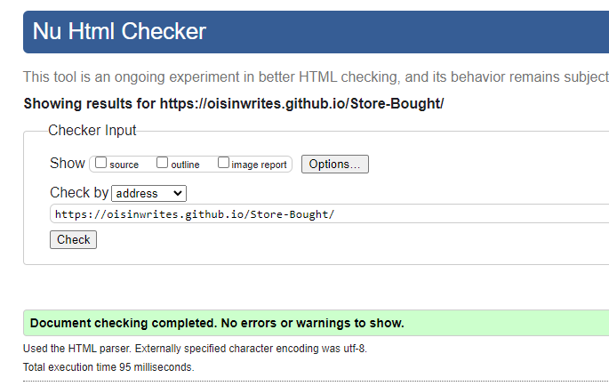

# if not, **Store Bought** is fine!
    This site is an encyclopedia of cocktail recipes, designed to be easily made at home.
    There is an increasing trend of consumers drinking at home because of factors such as the global pandemic, and now inflation.
    This site aims to make cocktail making accessible and simplified for the sitting room sipper.

## UX/UI
### Site Goals
- To be an visually attractive site
- To be plainly navigable
- To be able to communicate information in a clear and intelligible way
- To allow for interaction from the user in the form of photo submissions and reviews

### Design Choices
- 1 Colour
   - The navy and gold palette give a feel of luxury and decadence.
   Often found in art deco _(see image below for example)_ which was a prevalent style 
   during the roaring 20s; the rise of cocktail culture.
   The purpose of picking the palette, than an other, is too illicit a feeling of confidence from the user:
   if the site feels like a cocktail menu then the user may trust the information is genuine.
   Building on the palette, I chose a bright yellow; close enough to the gold to hold the theme,
   but more vibrant, giving the site a happier, fun, mood.
   The red used for the social media icon links ties in to the _cocktail-bar_ image, and works 
   well as an accent colour. This gives the footer a seperation from the navigation bar at the top, 
   but holds to the one theme.
   Lavender is used throughout the body content of all three pages, and was chosen as aan off-white alternative.
   It doesn't jar with the rest of the palette, but is distinct enough to differentiate content from 
   the rest of the screen.
- 
- 2 Typography
   - The font I chose for being legible, a bit fun, and having a nice 'hand-writing feel' as if recipes were jotted down by hand.
- 3 Imagery
   - The photos were chosen for their bright, high contrast, 'popping' imagery.
   They make the drinks look enticing and may engage the user and encourage the user to try the recipes.
   - The photo of a bar as the background was chosen because, even though this site is for making and drinking cocktails at home,
   the experience that is trying to be replicated and enjoyed is that of a cocktail bar. 
### User Stories
- #### As a first time visitor
   - I want to be able to navigate to the cocktail recipe section easily as that is my reason for visiting the site
   - I want the information to be clear and concise
   - I want to feel like the recipes easily replicated
   - I want to learn more detailed information about the drinks I like
   - I want help problem solving with swapping ingredients or utensils for what I have available to me
- #### As a recurring visitor
   - I want to have access to a broader selection of recipes
   - I might want to be able to contact the site owner to request certain recipes be posted
   - I would like to be able to submit photos of my own finished cocktails
   - I would like to be able to review the recipes and give feedback after trying them
### Features
   - A nav bar that directs to each page
   - A footer with three social media links, and a logo that directs to the homepage
   - A favicon in the meta of head, seen in browser tab
   - A form where users can post there own photo _(see future plans for site)_
   - Navbar items change opacity when hovered over
### Future plans for site
   - Change the simple existing form so that images are stored into the directory, possibly requiring php.
   - Additional recipes to be added, and then adding a search bar for them when required.
   - Put recipe measurements into tables that can adjust when values are changed, such as from ml to oz.
   - Create contact form to request recipes to uplaod.
   - Give recipes a star rating feature, usable by site user.
   - Embed youtube video of demonstrations.
   - Create content explaining alternatives to expensive bar tools. eg: use a big empty jar and lid instead of a shaker.
## Testing and bugs
### Bug log (not extensive)
   1. -Windows screen minimised no further than approx 500px, leaving mobile media screen untested/
      -Downloaded chrome extension for screen testing from mobilefirst.com
      -Discovered lack of responsivity and fixed problem, specifically the banner at width:400px;
      - _Mobile testing extension makes site look fine, however actual minimising window breaks responsivity below 480px_
   2. -Lighthouse noted lack of title in head of pages
      -Added meta title and icon
   3. -Validator noted <em> not allowed in a ul 
      -Forgot to write content into a list item
      -Error resolved after wrapping content in a li
   4. -Recipes page on large screens pushes beyond background on right
      -CSS code doesn't seem to be the issue, will delete and add html to problem solve
      -Issue is with section element, adjusting width to a % is helping
### Unfixed bugs
   1. Media screen resolution built from ""smallest screen size", the minimum size my windows on desktop would minimize to,
   which unfortunately was only 500px. In future I would scale down to as low as 280 and build up from there. 
   Site shows responsivity on medium and larger screens successfully.
   2. To remove second bullet point in history - adjective section.
   3. To bring first div in index content to middle of screen.
### Manual testing
- All links work as expected
- Media screen responsivity works well above 500px
- Form works correctly
### Running site through multiple testing programs   
- Mock-up on different screen sizes 
- 
- Wave Accessibility 
- 
- HTML validation 
- 
- CSS validation 
- 
- Lighthouse Performance 
- 
## Deployment
### To **deploy** the project on Github:
- Select the repository you wish to deploy.
- Click the *Settings* tab within that repository.
- In the *Settings*, scroll down and select *Pages*.
- In the *Source* section, click *Branch* and select the *main* option, click *Save*.
- The URL for the deployed project is now saved in *Pages*.
## Citiations
    -TextboxFroggy https://flexboxfroggy.com/
    -W3Schools https://www.w3schools.com/css
    -Sitepoint https://www.sitepoint.com/understanding-and-using-rem-units-in-css/
    -Delftstack https://www.delftstack.com/howto/css/css-font-border/
    -GeeksforGeeks https://www.geeksforgeeks.org/set-the-opacity-only-to-background-color-not-on-the-text-in-css/
    -Digitalocean https://www.digitalocean.com/community/tutorials/css-prevent-line-break
    -Favicon https://favicon.io/tutorials/how-to-add-a-favicon-to-a-website-ico-format/
   ### With particular credit and thanks to Laura Jones portfolio 1 repository,
   ### highlighted by mentor as a possible template and example for readme
    -Laura Jones https://laurajones9-portfoliop1-hodfbgh5vsu.ws-eu53.gitpod.io/
      _for explaining the solution she found to a white space issue on the right of screen_
      _as a guide for how to document and arrange my readme and screenshots_
      _for providing a template of a footer with icon links_
      _lifted deployment instructions for Github_
   